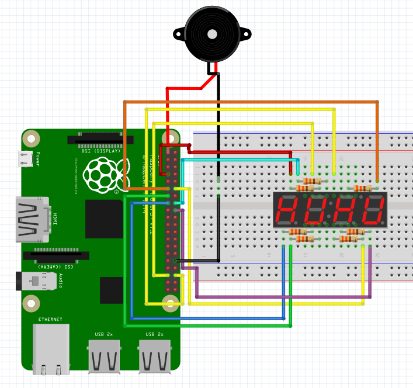

### Segment and Button project

#### Description
	- 4자릿수 세그먼트를 이용한 시한폭탄 장난감 구현
	- 지연시간을 활용, 점멸을 이용한 4자릿수 세그먼트 표현
	- 실행시간을 활용, 0초에 가까워질 때마다 피에조 부조의 울림 주기 빨라짐

#### Material
	- Four digit 7-Segment (cathode)
	- Piezo buzzer
	- Wire
	- Resistance 330Ω x 7

#### Source
[How to Four digit 7-Segment](https://m.blog.naver.com/PostView.nhn?blogId=dokkosam&logNo=221251177632&proxyReferer=https:%2F%2Fwww.google.com%2F)
[Python-Threading](https://sinwho.tistory.com/entry/%ED%8C%8C%EC%9D%B4%EC%8D%ACPython-%ED%83%80%EC%9D%B4%EB%A8%B8-%EC%82%AC%EC%9A%A9%ED%95%98%EA%B8%B0)
[Python-Buzzer & PWM](https://software-craftsman.tistory.com/46)
[Python-time](https://m.blog.naver.com/PostView.nhn?blogId=dsz08082&logNo=221601318378&proxyReferer=https:%2F%2Fwww.google.com%2F)