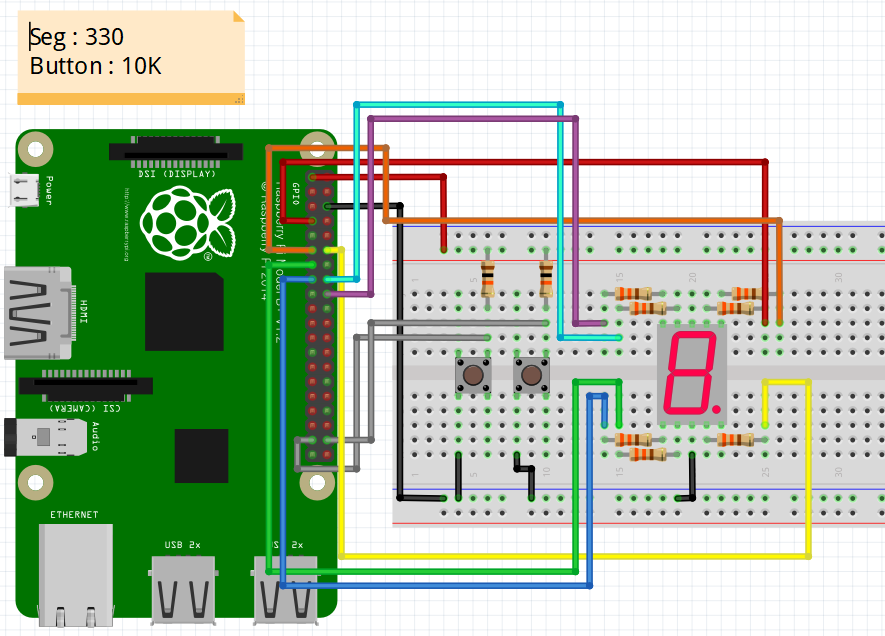

### Segment and Button project

#### Description
	- 버튼 2개를 이용하여 세그먼트를 제어하는 프로그램.
	- 왼쪽 버튼 클릭 시 카운트 + 1 
	- 오른쪽 버튼 클릭 시 카운트 - 1
	- 카운트 값에 따라 세그먼트 출력 값이 결정됨.

#### Material
	- 7-Segment (cathode) x 1
	- Button x 2
	- Wire
	- Resistance 330Ω
	- Resistance 10KΩ